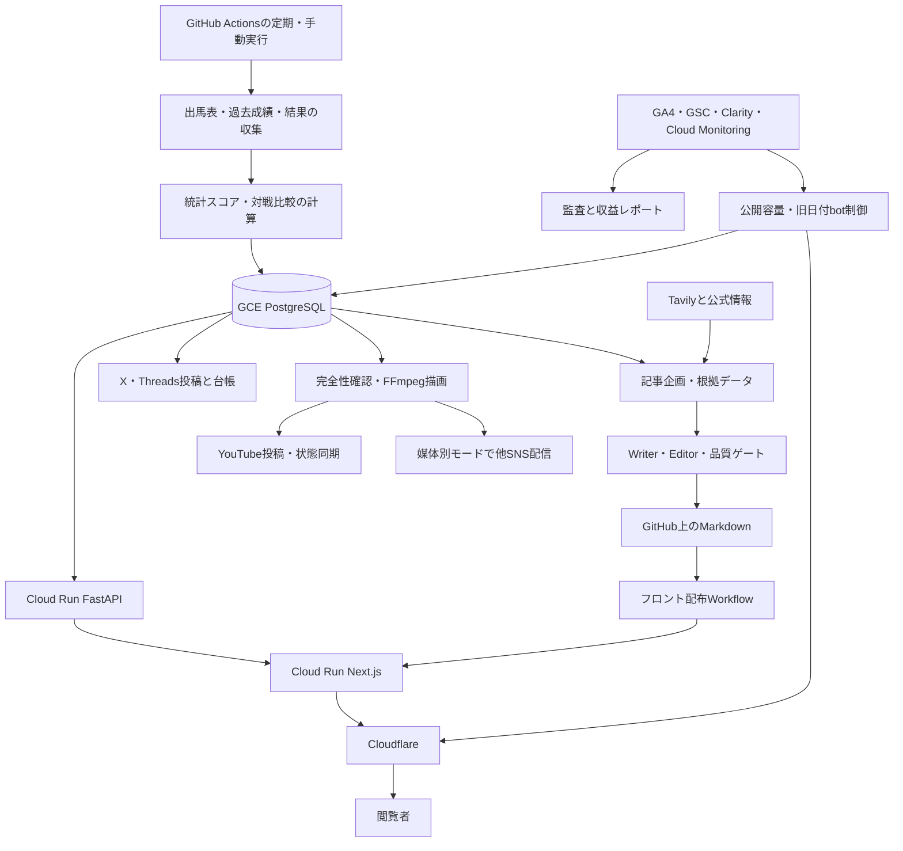

# UMA-FREEの機能とデータの流れ

この文書は2026-09-07時点のコードとGitHub Actionsを基に、利用者向けの画面と裏側の処理を結びつけた案内です。ファイル・ルート・全Workflowの索引は[自動生成一覧](automation-map.md)にあります。

## システム全体

DBは外部公開していません。Cloud Runからは内部VPC、GitHub Actionsと保守端末からはIAPを経由します。公開ページへアクセスするたびにスクレイピング・Gemini・動画処理が動く構成ではありません。

## 利用者から見える機能

| 機能 | 実装とデータ源 | 保存・表示の特徴 |
| --- | --- | --- |
| 日付・開催場・レース切替 | `app/races/`、予測API、`race_crud.py` | 保存済みの出走馬と予測を表示。現在付近のデータは短TTL |
| AI偏差値・印・序盤位置・対戦成績 | `scripts/predictor.py`、対戦計算、Prediction/Result | 欠損・対象外を明示。人気や実際の勝率そのものではない |
| 高配当実績・精度 | `hits/top-payouts`、`stats/accuracy`、`results/accuracy` | 確定結果に依存。新しい結果が未収集なら追いつかない |
| 重賞一覧・解説記事・カテゴリ・関連導線 | Markdown、重賞レジストリ、記事リンクAPI | 年度と代表URLを維持。記事の公開とレースデータ更新は別処理 |
| 馬・騎手・調教師・コース統計 | `growth_crud.py`と`api/v1/data` | DBの過去成績を集計。検索掲載には別の品質・容量台帳を使う |
| データ検索・馬比較 | `/search`、`/compare`、Next.jsのAPI中継 | DB読取。検索の重いクエリは別途計測対象 |
| お気に入り・閲覧履歴・比較対象 | `/my-data`、`lib/my-data.ts` | localStorage。お気に入り100、履歴30、比較5頭。ログイン同期・他端末共有はない |
| PWA | `PwaRegistration.tsx`、`public/sw.js` | ブラウザ登録が失敗しても通常閲覧を継続 |
| 広告・楽天競馬PR・関連グッズ | 広告設定、AffiliateSlot、楽天API解決 | 商品リンク解決はバックエンド。広告の空振りでも必要な高さを保持 |
| 利用説明・免責・問い合わせ | about、about-ai、faq、privacy、terms、contact | 静的案内と構造化データ |

マイデータや比較の保存キー、記事URL、公開画像のパスは利用者の状態や検索導線に関わるため、整理時に改名しません。

## 数値計算と生成AIの分担

`run_pipeline.py`が収集を制御し、`scraper.py`がHTML取得、`parser.py`がデータ抽出、`database_loader.py`と`db_handler.py`がDB保存を担います。既存履歴や鮮度による取得スキップ、待機・ワーカー数の制限があります。

現在の`predictor.py`は過去の走破タイムと条件別の平均タイムとの差を使い、180日を半減期とする重み付き平均を計算します。出走馬内の平均・標準偏差から`50 + 10 × (スコア − 平均) / 標準偏差`で相対評価を作ります。標準偏差が0なら50です。序盤位置の指標は別に計算します。

新馬・障害等の明示的除外、比較可能な過去データ不足、計算エラーを区別します。Geminiの文章生成は数値計算とは別経路です。画面の「AI」という名称から、LLMが偏差値を直接決めていると解釈しないでください。

## 日常の自動処理

下表は予定時刻のJST表記です。実際の開始には遅延があり、最新のUTC cronは[一覧](automation-map.md)とYAMLを正とします。

| 系統 | 予定と役割 |
| --- | --- |
| 確定結果 | 毎朝05:00、前日の結果を更新 |
| 当日の予測 | 毎朝06:30、10:00に取得・補完 |
| 翌日の予測 | 毎日13:30。定期実行成功がYouTubeの連動元 |
| 週末の補完 | 金曜12:00・15:00。専用の日付解決を使う |
| 手動収集 | `Keiba Data Fetch (Morning)`。名称はMorningだが定期cronはない |
| 記事 | 毎日08:00・11:45・16:45。朝だけではない |
| X・Threads | 毎日07:00・12:00・20:00、土日14:00の直前投稿、土日19:00の的中速報 |
| YouTube | 定期Afternoon成功時と18:20の予備cron。台帳で重複を抑止 |
| データ品質 | 毎日07:45、回遊集計は水曜09:45 |
| 検索と公開枠 | 重賞検索監視09:15、データページ公開09:45 |
| 週次収益・検索 | 水曜09:15のGSC、09:30の収益サイクル |
| DB転送監視 | UTC毎時17分。実測と条件に応じ古いアーカイブへのbot流入を制御 |

当日・翌日の対象日は主要収集Workflowで本来のcron時刻から解決します。ただし旧手動収集の`today/tomorrow`、SNSの時刻判定など、相対日付の入口も残っています。過去データの復旧は対象日を明示して行います。

## 記事生成と検索監査

企画は重賞カレンダー、DB統計、恒常テーマ、確定済みGSCの補修候補からWriteOrderを作ります。`frontend/scripts/agents/test_pipeline.ts`がWriter・Editor・SEO/数値/Evidenceの検査を制御します。このファイルは運用コードです。

`data/reference/`の中央・地方の重賞一覧・コース一覧・ジョッキーリーディングTXTも、`news_topic_planner.py`と`editorial_evergreen_planner.py`がローカル補助入力として参照します。ルートから資料用フォルダへ移し、両プランナーの参照先も更新しました。GitHub側にはこれらがない場合の既存経路があり、`docs/content/reference_data_summary.md`等も使用します。

承認済みだけをPublisherがMarkdownへ保存しGitHubを更新し、条件が合えばフロント配布Workflowへ連携します。同じ年度・重賞は代表URLを更新し、根拠がない枠順・予測・結果を作りません。Gemini障害時は回路遮断と未処理注文の保持で反復呼び出し・注文消失を抑えています。

品質ゲートによる「承認0件」は公開を止める動作です。ただし9/5にもEditor承認後の最終flow拒否があり、Editor承認だけで公開成功とは判断できません。定期監査・限定改稿の詳細は[GSC運用](../content/gsc_weekly_seo_operations.md)を参照してください。

## SNSと動画

X・Threadsの通常投稿は`sns_poster.py`です。SNS投稿台帳、内容ハッシュ、リトライ、片方だけ成功した場合の扱いがあります。Workflow成功だけで両媒体の投稿成功を断定しません。

YouTubeは対象レースをDB優先・API補助で読み、予測対象の一時欠損が残れば待機して再確認します。明示的な対象外だけなら続行できます。必要な横長・Shortの描画が揃い、素材権利・チャンネル・尺の検証を通ってからアップロードします。公開モードは予約・即時・レビュー用非公開の3種類です。

`video_publications`のstable ID・内容ハッシュ・remote IDで再実行を管理し、公開済み・予約済みの状態を保ちます。不完全な旧予約の差し替えは専用revisionを使い、履歴を消しません。

Threads・Instagram・Facebook・TikTok・Pinterest・Blueskyへの動画配信も実装されています。ただしWorkflow既定値は各媒体`validate`で、Repository Variablesと認証・素材許諾によって`disabled / validate / draft / public`を選びます。**実装があることと、現在外部投稿を有効にしていることは別です。**

今回確認した9/6のYouTube連動実行でも、6媒体すべて`validate`でした。YouTubeは9/7分の横長36レースとShort3レースの予約処理に成功しています。X・Threadsの通常画像投稿とは別の経路です。

## 収益と低コスト運用

AdSense、楽天競馬TrafficGate、楽天市場の商品リンク、Amazonリンクと、GA4・Clarityのイベント計測があります。固定運用の広告・PR設定はリリースゲートを通します。週次収益処理はGA4・GSC・Clarity・インフラ指標等を取得し、履歴とレポートを作ります。

費用を抑える既存の仕組みは、Cloud Runのゼロスケール、APIと収集バッチの分離、キャッシュ、単一レース取得、gzip、少数DB接続、段階的な検索公開、古いページへのbot制御、記事生成上限、素材保持期限です。今回、APIのビルド送信・配布ファイルも限定しました。

9/6の本番公開ジョブはyellow・公開3件でした。理由はCloudflare指標欠損に伴う制限で、公開停止ではありません。Cloud Runの月間外向き転送予測は約9.54 GiBで、これは請求実額ではありません。費用と残課題は[調査記録](repository-review-2026-09-07.md)を参照してください。

## 操作を間違えやすい境界

| 操作 | 起きること |
| --- | --- |
| `repository:check`、通常の回帰テスト | 構成・ロジック確認。本番投稿を行わない |
| `npm run build` | 配布用生成。API参照があるが記事生成や外部投稿は行わない |
| `article:pipeline`、`article:publish` | 課金API・記事更新・GitHub書き込みにつながる |
| `run_pipeline.py`、再計算・修復スクリプト | 収集やDB更新が発生し得る |
| SNS・YouTube Workflowの実行 | 設定次第で公開投稿と投稿台帳更新が発生 |
| cache purge・DB migration・deploy | 本番の状態を変更する |

障害時は対象日、取得数、予測対象外、承認数、公開数、投稿ID、失敗ステップを順に確認します。対応する[保守SOP](../../agent-sops/INDEX.md)を読み、成功済み投稿の台帳や現行データを削除せずに復旧します。
