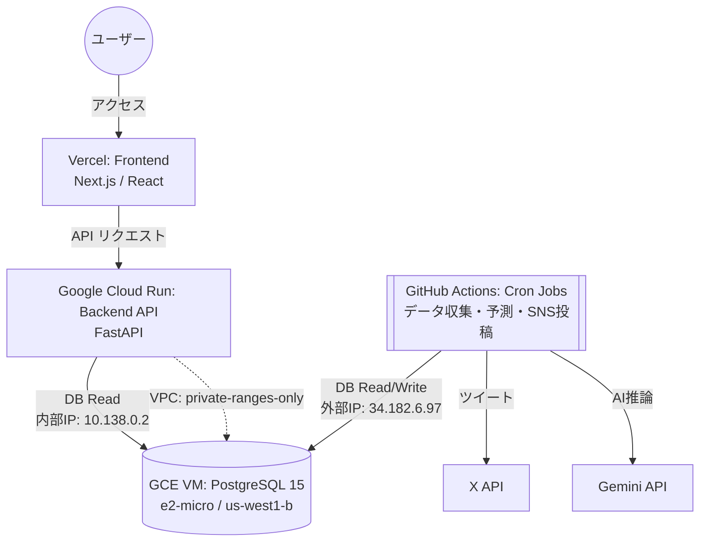

# コスト最適化アーキテクチャ（2026年4月改訂版）

> **2026-08-04更新**: Vercel HobbyのCPU・ISR writes・Edge Requests超過により、フロントエンドはCloud Run + Cloudflareへ移行準備中です。本章のVercel $0前提や「月額$0」表現は過去構成の記録であり、今後は`docs/cloud_run_cloudflare_migration_20260804.md`の容量ゲートと実測請求を正とします。

## 1. 背景と目的

### 1.1 初期構成（Render時代）
当初はバックエンド（API・DB・Cronジョブ）のすべてをRenderの有料プランで運用しており、月額約 $19.58 のランニングコストが発生していました。
また、開発・デプロイを繰り返した結果、Renderの無料ビルド枠（月間500分）に抵触し、CI/CDがブロックされる事象が発生しました。

### 1.2 第1次移行（2026年3月：Neon移行）
Renderから「Cloud Run + Neon (Serverless Postgres) + GitHub Actions」に完全移行し、月額 $0 を実現。

### 1.3 第2次移行（2026年4月：GCE移行）
Neon Free Tierの **Network Transfer 5GB/月** 上限を超過し、Computeが完全停止（サイトダウン）する事象が発生。
根本原因は、ISRリクエストやGitHub Actionsのジョブによるegress転送量の累積がNeon Free Tierの上限を超えたこと。
TTLキャッシュ実装やジョブ頻度削減等の施策では抑制しきれなかったため、**Google Compute Engine (GCE) の e2-micro VM（永久無料枠）に PostgreSQL を自前構築**する方針に切り替え、データを完全移行しました。

> **結論**: 現在は **月額 $0** かつ **転送量制限なし** のアーキテクチャで安定稼働中。

---

## 2. 現行システム構成図



---

## 3. 各コンポーネントの役割と選定理由

### ① フロントエンド（Vercel）
*   **用途**: Next.jsアプリケーションのホスティング。
*   **プラン**: Hobbyプラン（無料）
*   **狙い**: 静的リソースのCDN配信とISR（Incremental Static Regeneration）を活用し、バックエンドへの過剰なアクセスを緩和。

### ② バックエンドAPI（Google Cloud Run）
*   **用途**: FastAPIによるWeb API提供（フロントエンドからのデータ取得窓口）。
*   **旧環境**: Render Web Service（Starterプラン: $7.00/月）
*   **狙い・上限事項**:
    *   **ゼロスケール**: リクエストがないときはコンテナが停止するため、維持費が掛かりません。
    *   **コスト**: 月間200万リクエストまでは無料枠に収まるため、実質無料で運用可能。
    *   **VPC接続**: `default` ネットワークに接続し、`private-ranges-only` のVPC Egressを設定。GCE VMへは **内部IP (10.138.0.2)** 経由で通信するため、外部通信（egress）が発生しません。
    *   **コールドスタート**: VercelのISRキャッシュと組み合わせることでユーザー体験への影響を吸収。

### ③ データベース（GCE VM 自前 PostgreSQL）
*   **用途**: レース情報、予測データなどの永続化層（PostgreSQL 15）。
*   **旧環境**: Neon Serverless Postgres（Free Tier → Launch Plan $3/月）
*   **移行理由**: Neon Free TierのNetwork Transfer 5GB/月上限によるサイトダウン
*   **現構成**:
    *   **VM**: `e2-micro` インスタンス（GCE永久無料枠）
    *   **リージョン**: `us-west1-b`
    *   **内部IP**: `10.138.0.2`（Cloud Runからの接続用）
    *   **外部IP**: `34.182.6.97`（GitHub Actions・ローカル開発からの接続用）
    *   **DBユーザー**: `keiba_user` / DB名: `keiba_db`
    *   **ディスク**: 30GB 標準永続ディスク（無料枠内）
*   **PostgreSQL設定**:
    *   `shared_buffers = 256MB`（e2-micro最適化）
    *   `max_connections = 50`
    *   `pg_hba.conf`: Cloud Run VPCサブネット (`10.0.0.0/8`) と外部IPを許可
*   **メリット**:
    *   **転送量制限なし**: GCE→Cloud Run間はVPC内部通信のため無課金
    *   **ストレージ制限緩和**: 30GB（Neon Free Tierの512MBから大幅増加）
    *   **常時起動**: サーバーレスではないため、コールドスタートなし
*   **注意事項**:
    *   自動バックアップが無いため、定期的な `pg_dump` の導入を推奨
    *   VM再起動時はPostgreSQLが自動起動（systemdで管理）

### ④ バッチ定時処理・Cronジョブ（GitHub Actions）
*   **用途**: JRA等のレースデータ収集、Gemini APIによる予測実行、X（旧Twitter）への定期投稿など。
*   **旧環境**: Render Cron Jobs（8ジョブ合計: 約$6.28/月）
*   **狙い・上限事項**:
    *   **無料化**: GitHub Actions（ubuntu-latest）に完全移行しランニングコストゼロ。
    *   **上限**: パブリックリポジトリであれば実行時間は無制限、プライベートリポジトリでも月間 2,000分の無料枠。
    *   **DB接続**: GCE VMの外部IP (`34.182.6.97:5432`) 経由で接続。GitHub Secrets に `DATABASE_URL` を設定済み。

---

## 4. ネットワーク構成

```
┌─ Google Cloud (us-west1) ─────────────────────────────┐
│                                                        │
│   Cloud Run (keiba-site-v1)                            │
│   ├─ VPC: default                                      │
│   ├─ Subnet: default                                   │
│   └─ Egress: private-ranges-only                       │
│          │                                              │
│          │  内部通信 (10.138.0.2:5432)                  │
│          │  ※ egressコストなし                          │
│          ▼                                              │
│   GCE VM (keiba-db, e2-micro)                          │
│   ├─ 内部IP: 10.138.0.2                               │
│   ├─ 外部IP: 34.182.6.97 (静的)                       │
│   ├─ Firewall: allow-postgres (tcp:5432)               │
│   └─ PostgreSQL 15                                     │
│                                                        │
└────────────────────────────────────────────────────────┘
          ▲
          │  外部接続 (34.182.6.97:5432)
          │
  ┌───────┴────────┐
  │ GitHub Actions  │  ← Cron (データ収集・予測・SNS)
  │ ローカル開発    │  ← .env の DATABASE_URL
  └────────────────┘
```

---

## 5. コスト比較

| 項目 | Render時代 | Neon時代 | **GCE時代（現行）** |
|:---|:---|:---|:---|
| フロントエンド | Vercel $0 | Vercel $0 | **Vercel $0** |
| バックエンドAPI | Render $7 | Cloud Run $0 | **Cloud Run $0** |
| データベース | Render $7 | Neon $0 (Free) | **GCE e2-micro $0** |
| Cronジョブ | Render $6 | GitHub Actions $0 | **GitHub Actions $0** |
| **月額合計** | **$20** | **$0** | **$0** |
| 転送量制限 | なし | **5GB/月（致命的）** | **なし** |
| ストレージ | 1GB | 512MB | **30GB** |

---

## 6. 今後の運用上の注意点

*   **GCE VM監視**: https://console.cloud.google.com/compute/instances で VM が `RUNNING` であることを定期確認。
*   **バックアップ未設定**: GCE VMには自動バックアップがないため、`pg_dump` による定期バックアップcronの導入を推奨。
*   **ファイアウォール**: `allow-postgres` ルール（tcp:5432, 全IP許可）が設定済み。セキュリティ強化が必要な場合はソースIPを制限すること。
*   **e2-micro制約**: vCPU 0.25 / RAM 1GB のため、大量同時接続には対応できない。現在の `pool_size=2, max_overflow=1` の設定で問題なく稼働中。
*   **課金監視**: https://console.cloud.google.com/billing で、無料枠を超過していないか月次で確認。
*   **Neon**: 2026年4月11日付で解約済み。

---

## 7. 移行履歴

| 日付 | 内容 |
|:---|:---|
| 2026-03-xx | Render → Cloud Run + Neon + GitHub Actions に全面移行 |
| 2026-04-10 | Neon Network Transfer 5GB/月上限超過によりサイトダウン |
| 2026-04-11 | Neon Launch Plan ($3/月) に緊急アップグレード → 復旧 |
| 2026-04-11 | GCE e2-micro VM構築 → PostgreSQL 15セットアップ → データ完全移行 |
| 2026-04-11 | Cloud Run VPC接続 → DATABASE_URL切り替え → サイト復旧確認 |
| 2026-04-11 | GitHub Actions cron復元、GitHub Secrets更新 |
| 2026-04-12 | Neon解約完了 |
| 2026-06-13 | 2026年5月のGCPコスト要因（Network Analyzer, Artifact Registry等）を分析し、最適化アクションを追記 |

---

## 8. 2026年5月コスト発生の要因分析と最適化

2026年5月のGCP請求書（合計¥739）に基づき、当初想定していた「月額 $0」から超過した要因と、それを最適化（削減）するための具体的なアクションをまとめました。

### 8.1 要因の内訳と対策

| サービス | 発生費用 | 主な発生要因 | 最適化アクション（削減策） |
| :--- | :--- | :--- | :--- |
| **Networking** | **¥356** | Network Intelligence Center の **Network Analyzer** が有効になっており、監視対象リソースの稼働時間に応じて課金が発生。 | **Network Analyzer の自動監視を無効化** する（シンプルな構成のため常時監視は不要）。 |
| **Cloud Run** | **¥308** | コールドスタート対策としての最小インスタンス数（`min-instances`）の設定、またはCPUの常時割り当てが有効なため待機中も課金が発生。 | 最小インスタンス数を `0` に変更し、CPU割り当てを「リクエスト処理中のみ」とする（ゼロスケール化）。フロント側がISRのため遅延は影響しにくい。 |
| **Artifact Registry**| **¥58** | GitHub Actionsによるビルド・デプロイで古いコンテナイメージが蓄積し、無料枠（5GB）を超過。 | **クリーンアップポリシー** を設定し、古いイメージ（タグなしイメージ等）を自動削除するように設定。 |
| **Compute Engine** | **¥10** | `e2-micro`（us-west1）の無料枠内だが、ディスク種類（Standard以外）やサイズ（30GB超）、一時的な未使用IPアドレス等による微小な課金。 | ディスクが「標準永続ディスク」かつ30GB以下であるか、不要なスナップショットがないかを確認。 |

### 8.2 具体的な対応手順（GCPコンソールでの作業）

1. **Network Analyzer の無効化**:
   - GCPコンソールの「Network Intelligence Center」 ＞ 「Network Analyzer」に移動し、自動分析の実行を停止・無効化する。
2. **Cloud Run のゼロスケール設定**:
   - 「Cloud Run」から該当サービス（`keiba-site-v1`）を選択し、「新しいリビジョンの編集とデプロイ」を開く。
   - 最小インスタンス数を `0` に設定し、CPU割り当てが「リクエスト処理中のみ」であることを確認する。
3. **Artifact Registry のクリーンアップポリシー設定**:
   - 「Artifact Registry」で該当リポジトリを開き、「クリーンアップポリシー」タブから、古いイメージやタグなしイメージを自動でクリーンアップするルール（例：最新の3世代のみ保持）を有効化する。

---

## 9. 2026年8月の実測とコスト再発の分析

2026-08-15に `gcloud` / Cloud Monitoring API / Cloud Logging を読み取り専用で実測した結果。

### 9.1 使用量の実測（2026-07-17〜08-15の30日間）

| 項目 | 30日実測 | 無料枠 | 直近7日からの月換算 | 判定 |
|:---|---:|---:|---:|:---|
| Cloud Run vCPU秒 | 170,076 | 180,000 | 345,870 | 超過 |
| Cloud Run GiB秒 | 125,959 | 360,000 | 269,685 | 枠内 |
| Cloud Run リクエスト | 908,442 | 2,000,000 | 1,433,790 | 枠内(72%) |
| Cloud Run 送信（対外） | 10.7 GB | 1 GB | 17.3 GB | 課金 |
| GCE→Cloud Run 転送 | 445.7 GB | — | 1,165 GB | 要確認 |
| Artifact Registry | 2.45 GB | 0.5 GB | — | 超過 |
| Cloud Logging | 1.45 GB | 50 GiB | — | 枠内 |

GCS（6MB）、Cloud Build（月20回程度）、GCE e2-micro + 30GB pd-standard はいずれも無料枠内。
GCE VMの外部IPは削除済みで、アイドルIP課金は発生していない。

### 9.2 08-04を境にした急増

```
07-17〜07-30   0.34〜0.43 GB/日   （Vercel時代・安定）
07-31〜08-03   1.29〜1.69 GB/日
08-04以降     15.3〜115.7 GB/日  （Cloud Runフロントエンド稼働開始）
```

ピーク日（08-09）を時間別に分解すると、DB送信量はバックエンドのリクエスト数と線形に相関し、
バッチ処理起因ではないことを確認した。**1リクエストあたり2〜3.5MBをDBから読み、返すJSONは約1KB**。

### 9.3 特定した原因

| # | 原因 | 箇所 | 対応 |
|:--|:---|:---|:---|
| 1 | `_apply_publication_state()` が `entity_id` で絞らず、公開状態テーブルを毎回全件読み込み | `backend/crud/growth_crud.py` | 2026-08-15 修正済み |
| 2 | `_dataset_range()`（全レースのmin/max）を1リクエストで複数回実行 | `backend/crud/growth_crud.py` | 2026-08-15 TTLキャッシュ化 |
| 3 | アーカイブガードの遮断対象が検索エンジンのみで、Googlebot・bingbotだけが503を受け取っていた | `frontend/middleware.ts` | 2026-08-15 修正済み |
| 4 | `/articles` が `no-store` を返しCDNが常にBYPASS | `frontend/next.config.mjs` | 2026-08-15 修正済み |
| 5 | `app/robots.ts` が `public/robots.txt` に隠蔽され無効化。`sitemap-data.xml` の宣言も欠落 | `frontend/` | 2026-08-15 `public/robots.txt` へ統合 |
| 6 | フロント→バックエンドが公開run.app URL経由でインターネット往復 | `frontend/lib/api-base.ts` | 受け口のみ実装（下記の制約あり） |
| 7 | Artifact Registry のクリーンアップが緩い（keepCount 10 / 14日） | Artifact Registry | 未対応 |
| 8 | `keiba-frontend-v1` の maxScale が 20（移行文書の想定は2） | Cloud Run | 未対応 |

### 9.4 オリジン到達の内訳（直近3時間・3,000件）

- ルート別: `/races` 52%（うち15日以上前が64%）、`/horses` 9%、検索 7%
- UA別: 人間/不明 59%、Meta 26%、bingbot 7%、その他ボット 6%、Googlebot 1%

Cloudflareのキャッシュ自体は機能している（アーカイブレース・トップページともHIT）。
ただしレース詳細・競走馬詳細は件数が非常に多く、クローラーが1件ずつ辿ると
初回アクセスは必ずMISSになる。したがって「キャッシュを強くする」ではなく
「1回のオリジン処理を安くする」「大量巡回そのものを減らす」の両方が必要。

### 9.5 バックエンドAPIの呼び出し元（実測）

| 呼び出し元 | 割合 | 主な対象 |
|:---|---:|:---|
| SSR（Cloud Runフロントエンド、UA=`node`） | 81% | レース詳細・データ詳細 |
| ブラウザ直接 | 18% | `/api/v1/predictions/matchups/` |

**ブラウザがバックエンドを直接叩いているため、`keiba-site-v1` を内部ingress専用にはできない。**
対戦成績機能が動かなくなる。SSRだけを内部経路へ寄せる場合も、
Cloud Run間の内部通信には VPC egress の `all-traffic` 化と Private Google Access の
DNS設定が必要で、削減見込みは月4.2GB（約¥75）にとどまる。費用対効果は低い。

### 9.6 修正デプロイ後の実測（2026-08-16 09:56 JST デプロイ）

同一トラフィック水準での比較（Cloud Run リビジョン `00363` → `00364`）。

| 指標 | 修正前 | 修正後 | 変化 |
|:---|---:|---:|---:|
| DB送信量 / バックエンド1リクエスト | 0.60〜0.94 MB | 0.011 MB | 約1/60 |
| 5分あたりDB送信量（req数ほぼ同等） | 49〜58 MB | 1.0 MB | 約1/50 |
| `/api/v1/data/horses/{id}` 平均応答 | 6,040 ms | 168 ms | 約1/36 |
| 同 最大応答 | 32,860 ms | 330 ms | 約1/100 |
| データ詳細API p95（ログ集計） | 10.93 秒 | 0.76 秒未満 | — |

月換算では DB送信 約1,165 GB → 約7 GB の見込み（目標50GB以下を達成）。

クローラー制御の動作確認：

| UA | アーカイブレース | 未公開データ詳細 |
|:---|:---|:---|
| Googlebot | 200 | 200 |
| bingbot | 200 | — |
| facebookexternalhit | 200 | — |
| 通常ブラウザ | 200 | — |
| meta-webindexer | 503 | 503 |
| GPTBot | 503 | — |

`/articles` は BYPASS から HIT へ改善。`robots.txt` に `sitemap-data.xml` 宣言を追加済み。

### 9.7 未確定事項

`GCE→Cloud Run` 間の転送（月1,165GB）が実際に課金対象かどうかが最大の不確実要素で、
月¥1,750規模の差になる。BigQuery請求エクスポートを設定してSKU別に確定させること。

---

## 10. 2026年8月23日: 予算アラート50%到達の原因と対処

### 10.1 何が起きたか

請求先アカウント全体の¥1,000予算が50%に到達した。原因は keiba ではなく、
**同じ請求先アカウントに属する別プロジェクト `kotoba-map-demo`** だった。

本章がこれまで前提にしてきた「keiba-api-project 単体で月額$0」という見方には穴があった。
この請求先アカウント `011792-1B921B-D482B0` には4プロジェクトがぶら下がっている。

| プロジェクト | プロジェクト番号 | 内容 |
|:---|:---|:---|
| `keiba-api-project` | 761440273070 | UMA-FREE本体 |
| `kotoba-map-demo` | 315170697037 | Cloud Run `kotoba-map`（us-central1） |
| `gen-lang-client-0119313681` | 435385221353 | AI Studio「UMA-FREE Project」（Gemini APIキー） |
| `gen-lang-client-0518558289` | 531026331332 | AI Studio「caption」 |

**Cloud Runの無料枠（月180,000 vCPU秒 / 360,000 GiB秒 / 200万リクエスト）は
プロジェクト単位ではなく請求先アカウント単位で共有される。**
したがって他プロジェクトが枠を食えば、keibaの使用分がそのまま課金対象になる。

### 10.2 直接原因

Cloud Scheduler ジョブ `kotoba-map-warm` が `*/3 * * * *`（3分おき）で
`kotoba-map` の `/api/health` を叩き続けていた。
Cloud Run は最終リクエストから十数分インスタンスを保持するため、3分間隔で叩くと
インスタンスは一度も落ちない。`min-instances=0` でも実質「常時起動」と同じ課金になる。

`billable_instance_time` の日次実測:

```
                keiba(front+back)   kotoba-map
2026-08-20          3,668 s         （未稼働）
2026-08-21          3,973 s          43,919 s
2026-08-22          3,442 s          86,387 s  ← 86,400s/日 = 24時間フル稼働
2026-08-23          3,409 s          55,547 s
```

`kotoba-map` は 1 vCPU / 2GiB 割当で、CPU使用率 p99 は約1%。
**何もしていないコンテナを24時間課金し続けていた。** 実利用は1日約300リクエスト。

7日窓での月間換算（対処直前）:

| 指標 | keiba | kotoba-map | 合計 | 無料枠 |
|:---|---:|---:|---:|---:|
| vCPU秒 | 115,545 | 796,665 | 912,210 | 180,000 |
| GiB秒 | 90,415 | 1,593,330 | 1,683,745 | 360,000 |

放置した場合の見込みは月¥9,000〜11,000規模。

### 10.3 実施した対処

| # | 対象 | 内容 |
|:--|:---|:---|
| 1 | `kotoba-map-warm` | **一時停止（PAUSED）**。24時間課金の直接原因を除去 |
| 2 | `kotoba-map` | `maxScale` 4 → 2（暴走時の上限） |
| 3 | Artifact Registry | `keiba-api-project/cloud-run-source-deploy`（7日削除+直近5世代保持）と `kotoba-map-demo/cloud-run-source-deploy`（7日削除+直近3世代保持）へクリーンアップポリシーを新設 |
| 4 | 予算 | `Gemini API (gen-lang) 100 JPY` を新設（実額50%/100%・予測100%）。gen-lang 2プロジェクトはどの予算の対象にもなっていなかった |
| 5 | 予算 | 請求先全体¥1,000予算へ **予測100%** のしきい値を追加。従来は実額のみで、超えてから気づく設計だった |
| 6 | 監視 | `cloud_run_capacity.py` に共有枠の合算機能を追加（下記10.4） |

`kotoba-map` のメモリ 2GiB は**下げていない**。メモリ使用率 p99 が81%（約1.6GiB）あり、
1GiB以下へ落とすとOOMになる。`startup-cpu-boost` も有効のまま残した。
ウォーム停止後はコールドスタートが常態になるため、起動を速く保つ方が有効と判断した。
実測でコールドスタートを含めて0.57秒で応答しており、そもそもウォームアップ自体が不要だった。

### 10.4 監視の穴とその修正

`backend/scripts/agents/cloud_run_capacity.py` は `--project-id` 1つ分しか見ておらず、
`keiba-frontend-v1` と `keiba-site-v1` の合算しか計算していなかった。
**無料枠が請求先アカウント単位で共有される以上、他プロジェクトを見なければ枠の残量を判定できない。**
今回まさにこれが起きており、keiba側だけを見れば健全（115,545 vCPU秒）に見える一方で、
アカウント全体は 912,210 vCPU秒（枠の5.1倍）だった。

追加した仕様:

- `--shared-quota-config service,cpu,memory_gib,max_instances[,project_id]`
  同じ請求先の無料枠を消費するが、keibaの公開可否そのものは左右させないサービスを指定する。
- `--service-config` も5要素目に `project_id` を取れるよう後方互換で拡張。
- 出力へ `shared_quota_*` / `billing_account_projected_monthly_*` / `free_tier_*` を追加（`schema_version` は `cloud-run-capacity.v3` のまま。追加のみで既存キーは不変）。
- `determine_capacity_mode()` は、請求先全体が無料枠を超えている場合と
  共有枠の指標を取得できない場合を **yellow** とする。**red にはしない。**
  他プロジェクトの状態でkeibaの検索公開を止めても事態は改善しないため。

`.github/workflows/keiba-data-page-publication.yml` と `keiba-db-egress-guard.yml` の両方へ
`--shared-quota-config kotoba-map,1,2,2,kotoba-map-demo` を追加済み。

**未実施（要ユーザー操作）**: GitHub Actions のサービスアカウントに
`kotoba-map-demo` の閲覧権限が無いため、現状は共有枠を取得できず yellow へ縮退する。

```bash
gcloud projects add-iam-policy-binding kotoba-map-demo \
  --member="serviceAccount:github-actions-iap-db@keiba-api-project.iam.gserviceaccount.com" \
  --role="roles/monitoring.viewer"
```

### 10.5 keiba側の状況（対処不要）

2026-08-16の修正が効いており、約3,400秒/日・月間換算115,545 vCPU秒。
単体では無料枠180,000秒に収まっている。ただし §7 のゲート閾値（green 72,000 / red 120,000）
に照らすと **red の120,000へ近い** ため、余力は大きくない。

Cloud Run の外向き通信は `keiba-frontend-v1` 月約10.6GB、`keiba-site-v1` 月約4.8GB の
合計約15.5GB（無料枠1GB）で、月約¥250。§9.5 の判断どおり、
Cloud Run間の内部経路化は削減見込みが小さく費用対効果が低いため着手していない。

### 10.6 調査中に判明した別問題（コストとは無関係）

`https://uma-free.com/sitemap-data.xml` が**常に失敗している**。
直近2日で 404 が28件・502 が18件、成功はゼロ。

原因はバックエンドの `/api/v1/data/sitemap-manifest` が応答しないこと（40秒経っても返らない）。
フロントはこれを待って31秒でタイムアウトし502を返している。

影響は2つある。

1. **データサイトマップが機能していない。** `public/robots.txt` は `sitemap-data.xml` を宣言しているが、Googleは常に取得に失敗する。§3.2 で設計したshard構成が検索へ届いていない。
2. **段階公開ゲートが red で固定されている。** 31秒の502が `request_latencies` を押し上げ、`keiba-frontend-v1` の p95 が 32,840ms（p50 でさえ 31,490ms）として観測される。`determine_capacity_mode()` は p95>=2,500ms を red とするため、**データページの新規公開は0件/日のまま**。サイト自体は正常で、トップページの実応答は0.06〜0.45秒。

#### 原因

`backend/crud/growth_crud.py` の `get_data_sitemap()` が
`list_entities()` を1,000件ずつ全件ページングしていた。
`_directory_people_or_horses()` は1回の呼び出しで `results` と `races` の全件集計
（`GROUP BY` + `HAVING` を包んだ `count()` と本体クエリ）を2回走らせる。
競走馬だけで対象18,591件・19ページあるため、数十回の全件集計になっていた。
しかも完走しないので3600秒キャッシュにも載らず、毎リクエストが最初からやり直していた。

ローカルの実データ（2026-07-30時点のスナップショット・SQLite）での実測:

| entity | 対象件数 | 1ページ | ページ数 | 推定合計 |
|:---|---:|---:|---:|---:|
| course | 182 | 2.30s | 1 | 2.3s |
| horse | 18,591 | 2.63s | 19 | 50.0s |
| jockey | 413 | 2.18s | 1 | 2.2s |
| trainer | 592 | 2.16s | 1 | 2.2s |
| **合計** | | | | **約57s** |

Cloud Runのタイムアウトは30秒。本番はレースが1か月ぶん多く、
共有e2-microのPostgreSQLへネットワーク越しに問い合わせるため、これより更に遅い。
深いOFFSETほど遅くなるので57秒は下限であって上限ではない。

#### 修正

sitemapへ載るのは `data_page_publications` が `published` のものだけで、
その表は `url` と `last_seen_data_at`（最終レース日）を持っている。
品質と鮮度の判定は日次の段階公開ジョブが済ませているため、リクエスト時に計算し直す必要はない。
`get_data_sitemap()` を、索引の効く1クエリで公開済み行だけを読む実装へ変更した。

同じローカルDBでの実測は **0.0007秒**。全件集計は1度も走らない。

#### あわせて修正した設定のずれ

段階公開ゲートを塞いでいた条件はもう1つあった。
`deploy-frontend-cloud-run.yml` は `--max=4` でデプロイしているのに、
監視workflowが `cloud_run_capacity.py` へ渡す `--service-config` は
`keiba-frontend-v1,1,1,2`（上限2）のままだった。
実測4台に対して宣言2台を比べるため `max_instance_saturated` が恒常的に真になっていた。

`keiba-monetization-cycle.yml` の `keiba-site-v1,1,1,2` も実体（512Mi / max 3）と食い違っていた。
3つのworkflowを実サービスの値へ揃えた。

| サービス | 実際 | 修正後の宣言 |
|:---|:---|:---|
| `keiba-frontend-v1` | 1 vCPU / 1Gi / max 4 | `1,1,4` |
| `keiba-site-v1` | 1 vCPU / 512Mi / max 3 | `1,0.5,3` |

#### 反映後の注意

`p95_latency_ms` と `max_instance_saturated` は**7日窓**で評価される。
修正をデプロイしても、31秒の502が窓から抜けるまで最大7日はゲートがredのままになる。
インスタンス上限への到達も、ハングしたリクエストがインスタンスを占有して
オートスケールを誘発した結果と考えられるため、同時に解消する見込み。
