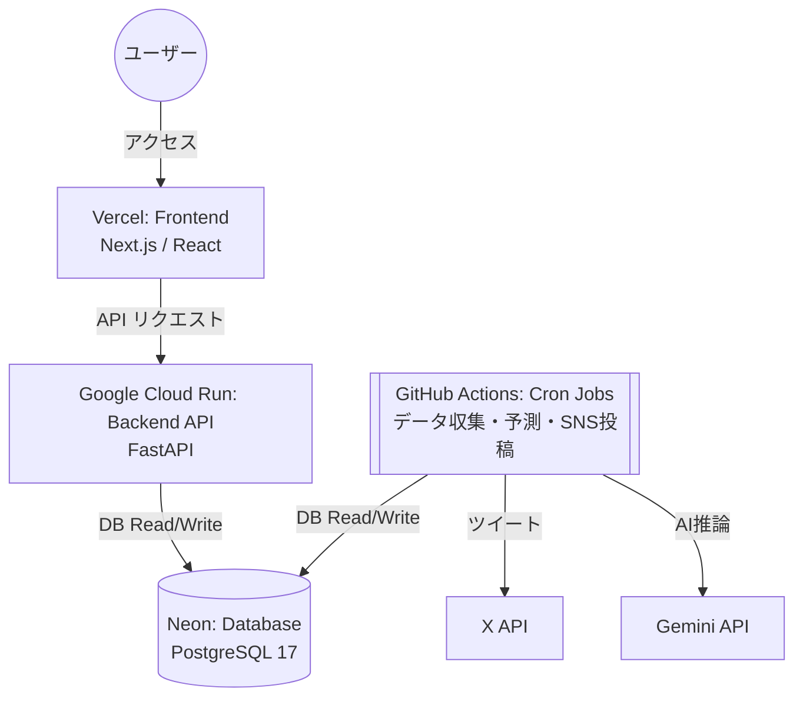

# コスト最適化アーキテクチャ（2026年3月移行版）

## 1. 背景と目的
当初のシステム構築時はバックエンド（API・DB・Cronジョブ）のすべてをRenderの有料プランで運用しており、月額約 $19.58 のランニングコストが発生していました。
また、開発・デプロイを繰り返した結果、Renderの無料ビルド枠（月間500分）に抵触し、CI/CDがブロックされる事象も発生しました。
これを受け、**「稼働安定性を維持しつつ維持費を $0 に限りなく近づける（コスト最適化）」** ことを最大の狙いとして、各コンポーネントを最新のサーバーレス/マネージドサービスへ分散・移行しました。

## 2. 新システム構成図

## 3. 各コンポーネントの役割と選定理由・上限（狙い）

### ① フロントエンド（Vercel）
*   **用途**: Next.jsアプリケーションのホスティング。
*   **プラン**: Hobbyプラン（無料）
*   **狙い・上限事項**:
    *   静的リソースのCDN配信とISR（Incremental Static Regeneration）を活用し、バックエンドへの過剰なアクセスを緩和。
    *   Vercel Hobbyの帯域幅（Fast Data Transfer等）の上限に注意が必要ですが、API側を切り離したことで負荷軽減を見込んでいます。

### ② バックエンドAPI（Google Cloud Run）
*   **用途**: FastAPIによるWeb API提供（フロントエンドからのデータ取得窓口）。
*   **旧環境**: Render Web Service（Starterプラン: $7.00/月）
*   **狙い・上限事項**:
    *   **ゼロスケール**: リクエストがないときはコンテナが停止するため、維持費が掛かりません（スケールツーゼロ）。
    *   **コスト**: 月間200万リクエストまでは無料枠に収まるため、実質無料で運用可能。
    *   **コールドスタート**: 一定時間アクセスがない状態からの初回アクセス時は数秒の起動ラグ（コールドスタート遅延）が発生しますが、Vercelのキャッシュ機構（ISR）と組み合わせることでユーザー体験への影響を吸収しています。

### ③ データベース（Neon）
*   **用途**: レース情報、予測データ、ユーザー情報などの永続化層（PostgreSQL）。
*   **旧環境**: Render PostgreSQL（Basicプラン: $6.30/月）
*   **狙い・上限事項**:
    *   **Serverless Postgres**: Neonはコンピュートとストレージが分離されたサーバーレス構成であり、無料プラン（Free Tier）を提供しています。
    *   **上限**: ストレージ容量 512MB / コンピュート時間の上限あり。
    *   今回、無駄なログや古い肥大化データ（Bloat）をそぎ落とし、Neonの強力な圧縮を効かせたことで、430MBあったデータが約30MBまで圧縮されました。これにより長期間の無料枠内での運用が可能と判断しました。
    *   **注意**: 接続時は `-pooler` 付きのURLを使うことでコネクションを効率化します（DDL等マイグレーション時のみ直接接続を利用）。

### ④ バッチ定時処理・Cronジョブ（GitHub Actions）
*   **用途**: JRA等のレースデータ収集、Gemini APIによる予測実行、X（旧Twitter）への定期投稿など。
*   **旧環境**: Render Cron Jobs（8ジョブ合計: 約$6.28/月）
*   **狙い・上限事項**:
    *   **無料化**: RenderではCron一つ一つに課金が発生していましたが、GitHub Actions（ubuntu-latest）に完全移行することでランニングコストをゼロにしました。
    *   **上限**: パブリックリポジトリであれば実行時間は無制限、プライベートリポジトリであっても月間 2,000分 の無料枠があります（当環境の重いスクレイピング処理などを考慮しても十分収まる範囲です）。

## 4. 今後の運用上の注意点
*   **スケール時の対応**: サイト規模が拡大し、Neonの512MBストレージ制限やCloud Runの200万リクエスト枠を超える場合は少額の課金プランへの自動移行などを検討してください。
*   **デプロイフロー**: APIのデプロイはGitHubの `main` ブランチへのPushと連動してCloud Buildが自動的に行うように設定されています。手動での反映は不要です。
