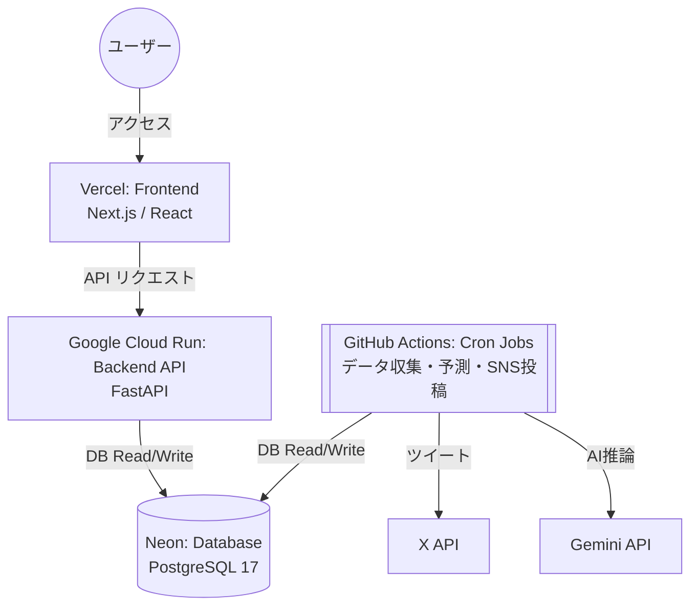

# コスト最適化アーキテクチャ（2026年3月移行版）

## 1. 背景と目的
当初のシステム構築時はバックエンド（API・DB・Cronジョブ）のすべてをRenderの有料プランで運用しており、月額約 $19.58 のランニングコストが発生していました。
また、開発・デプロイを繰り返した結果、Renderの無料ビルド枠（月間500分）に抵触し、CI/CDがブロックされる事象も発生しました。
これを受け、**「稼働安定性を維持しつつ維持費を $0 に限りなく近づける（コスト最適化）」** ことを最大の狙いとして、各コンポーネントを最新のサーバーレス/マネージドサービスへ分散・移行しました。

## 2. 新システム構成図

## 3. 各コンポーネントの役割と選定理由・上限（狙い）

### ① フロントエンド（Vercel）
*   **用途**: Next.jsアプリケーションのホスティング。
*   **プラン**: Hobbyプラン（無料）
*   **狙い・上限事項**:
    *   静的リソースのCDN配信とISR（Incremental Static Regeneration）を活用し、バックエンドへの過剰なアクセスを緩和。
    *   Vercel Hobbyの帯域幅（Fast Data Transfer等）の上限に注意が必要ですが、API側を切り離したことで負荷軽減を見込んでいます。

### ② バックエンドAPI（Google Cloud Run）
*   **用途**: FastAPIによるWeb API提供（フロントエンドからのデータ取得窓口）。
*   **旧環境**: Render Web Service（Starterプラン: $7.00/月）
*   **狙い・上限事項**:
    *   **ゼロスケール**: リクエストがないときはコンテナが停止するため、維持費が掛かりません（スケールツーゼロ）。
    *   **コスト**: 月間200万リクエストまでは無料枠に収まるため、実質無料で運用可能。
    *   **コールドスタート**: 一定時間アクセスがない状態からの初回アクセス時は数秒の起動ラグ（コールドスタート遅延）が発生しますが、Vercelのキャッシュ機構（ISR）と組み合わせることでユーザー体験への影響を吸収しています。

### ③ データベース（Neon）
*   **用途**: レース情報、予測データ、ユーザー情報などの永続化層（PostgreSQL）。
*   **旧環境**: Render PostgreSQL（Basicプラン: $6.30/月）
*   **狙い・上限事項**:
    *   **Serverless Postgres**: Neonはコンピュートとストレージが分離されたサーバーレス構成であり、無料プラン（Free Tier）を提供しています。
    *   **上限**: ストレージ容量 512MB / コンピュート時間 100 CU-hrs/月 / **Network Transfer 5GB/月**
    *   今回、無駄なログや古い肥大化データ（Bloat）をそぎ落とし、Neonの強力な圧縮を効かせたことで、430MBあったデータが約30MBまで圧縮されました。これにより長期間の無料枠内での運用が可能と判断しました。
    *   **Compute最適化（2026-04-11更新）**: Autoscaleを0.25 CU固定に設定。MonitoringでCPU/RAM使用率が0.25CU以下で安定していることを確認済み。月間 0.25CU × 8h/日 × 30日 = 60 CU-hrs ≤ 100 CU-hrs 無料枠。
    *   **Network Transfer最適化（2026-04-11更新）**: Cloud Run API側の全エンドポイントにTTLキャッシュを実装。サイトマップは24時間、重賞情報は1時間、マッチアップは1時間、予測データは日付・時刻に応じた動的TTLでキャッシュ。DB到達クエリ数を最小化しegress転送量を削減。接続プールも pool_size=2, max_overflow=1 に縮小。
    *   **注意**: 接続時は `-pooler` 付きのURLを使うことでコネクションを効率化します（DDL等マイグレーション時のみ直接接続を利用）。

### ④ バッチ定時処理・Cronジョブ（GitHub Actions）
*   **用途**: JRA等のレースデータ収集、Gemini APIによる予測実行、X（旧Twitter）への定期投稿など。
*   **旧環境**: Render Cron Jobs（8ジョブ合計: 約$6.28/月）
*   **狙い・上限事項**:
    *   **無料化**: RenderではCron一つ一つに課金が発生していましたが、GitHub Actions（ubuntu-latest）に完全移行することでランニングコストをゼロにしました。
    *   **上限**: パブリックリポジトリであれば実行時間は無制限、プライベートリポジトリであっても月間 2,000分 の無料枠があります（当環境の重いスクレイピング処理などを考慮しても十分収まる範囲です）。

## 4. 今後の運用上の注意点
*   **Neon Network Transfer（最重要）**: Free Tierの **5GB/月を超過するとComputeが完全停止（サイトダウン）** する。以下の施策で月2.1-4.5GBに抑制している。超過傾向が見られた場合はArticle Pipelineを一時停止するか、Launch Plan（$3-6/月）への緊急アップグレードを検討すること。
*   **Neon Compute**: 0.25 CU固定で月60 CU-hrs消費（Free枠100 CU-hrs）。余裕はあるが、サイト規模拡大時はMonitoringのCPU/RAMグラフを確認し、0.25CUで不足する兆候があればAutoscale Maxを引き上げること。
*   **スケール時の対応**: サイト規模が拡大し、Neonの512MBストレージ制限やCloud Runの200万リクエスト枠を超える場合は少額の課金プランへの移行を検討してください。
*   **デプロイフロー**: APIのデプロイはGitHubの `main` ブランチへのPushと連動してCloud Buildが自動的に行うように設定されています。手動での反映は不要です。

## 5. Network Transfer 削減施策一覧（2026-04-11実施）

### 施策①: Article Pipeline 頻度削減（▲月2.4GB）
*   `keiba-article-pipeline.yml` の cron を `毎日` → `火曜・土曜` に変更
*   火曜: 統計記事（data_scientist.py による分析）を生成
*   土曜: 重賞プレビュー記事を生成（金曜に予測データ生成済みのため高品質）

### 施策②: 早朝予測ジョブ廃止（▲月0.5-1.5GB）
*   `keiba-data-fetch-morning-today.yml` (JST 06:30) の自動実行を廃止
*   `keiba-data-fetch-retry-today.yml` (JST 10:00) に統合
*   前日 `afternoon` ジョブ (JST 13:30) で当日予測は既に生成済みのため影響なし

### 施策③: ISR revalidate 延長（▲月0.2-0.8GB）
*   `frontend/lib/api.ts` の `getPredictionsForDate` / `getSpecialPick` を `1800秒(30分)` → `3600秒(1時間)` に変更
*   stale-while-revalidate方式のためユーザーには常にデータが返る

### 施策④: Cloud Run API TTLキャッシュ（Phase 2で実施済み）
*   `race_crud.py` に `_TTLCache` クラスによるインメモリキャッシュを実装
*   予測・注目馬・対戦成績・サイトマップ・重賞情報すべてにTTLキャッシュ適用
*   接続プール最適化 (`pool_size=2`, `max_overflow=1`, `pool_recycle=900`)

### 月間egress試算（全施策適用後）
| 項目 | 推定egress |
|:---|:---|
| Article Pipeline (週2回) | 0.6-1.0GB |
| 当日予測 (retry-today × 1回/日) | 0.5-1.5GB |
| 翌日予測 (afternoon × 1回/日) | 0.5-1.5GB |
| 金曜週末予測 | 0.1-0.4GB |
| SNS関連 + 結果取得 | 0.15-0.9GB |
| Cloud Run API (ISR 1時間) | 0.25-0.8GB |
| **合計** | **2.1-6.0GB** |

