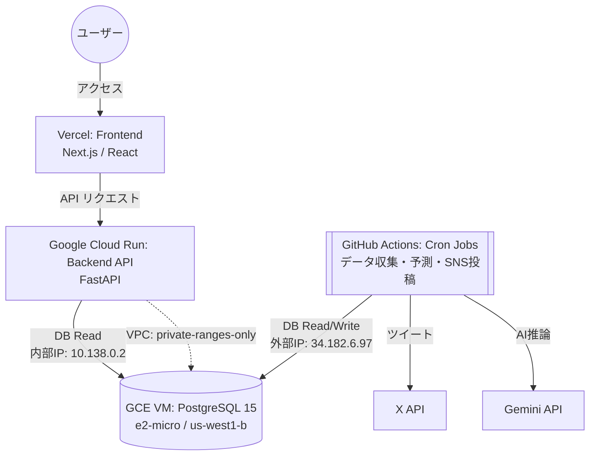

# コスト最適化アーキテクチャ（2026年4月改訂版）

## 1. 背景と目的

### 1.1 初期構成（Render時代）
当初はバックエンド（API・DB・Cronジョブ）のすべてをRenderの有料プランで運用しており、月額約 $19.58 のランニングコストが発生していました。
また、開発・デプロイを繰り返した結果、Renderの無料ビルド枠（月間500分）に抵触し、CI/CDがブロックされる事象が発生しました。

### 1.2 第1次移行（2026年3月：Neon移行）
Renderから「Cloud Run + Neon (Serverless Postgres) + GitHub Actions」に完全移行し、月額 $0 を実現。

### 1.3 第2次移行（2026年4月：GCE移行）
Neon Free Tierの **Network Transfer 5GB/月** 上限を超過し、Computeが完全停止（サイトダウン）する事象が発生。
根本原因は、ISRリクエストやGitHub Actionsのジョブによるegress転送量の累積がNeon Free Tierの上限を超えたこと。
TTLキャッシュ実装やジョブ頻度削減等の施策では抑制しきれなかったため、**Google Compute Engine (GCE) の e2-micro VM（永久無料枠）に PostgreSQL を自前構築**する方針に切り替え、データを完全移行しました。

> **結論**: 現在は **月額 $0** かつ **転送量制限なし** のアーキテクチャで安定稼働中。

---

## 2. 現行システム構成図



---

## 3. 各コンポーネントの役割と選定理由

### ① フロントエンド（Vercel）
*   **用途**: Next.jsアプリケーションのホスティング。
*   **プラン**: Hobbyプラン（無料）
*   **狙い**: 静的リソースのCDN配信とISR（Incremental Static Regeneration）を活用し、バックエンドへの過剰なアクセスを緩和。

### ② バックエンドAPI（Google Cloud Run）
*   **用途**: FastAPIによるWeb API提供（フロントエンドからのデータ取得窓口）。
*   **旧環境**: Render Web Service（Starterプラン: $7.00/月）
*   **狙い・上限事項**:
    *   **ゼロスケール**: リクエストがないときはコンテナが停止するため、維持費が掛かりません。
    *   **コスト**: 月間200万リクエストまでは無料枠に収まるため、実質無料で運用可能。
    *   **VPC接続**: `default` ネットワークに接続し、`private-ranges-only` のVPC Egressを設定。GCE VMへは **内部IP (10.138.0.2)** 経由で通信するため、外部通信（egress）が発生しません。
    *   **コールドスタート**: VercelのISRキャッシュと組み合わせることでユーザー体験への影響を吸収。

### ③ データベース（GCE VM 自前 PostgreSQL）
*   **用途**: レース情報、予測データなどの永続化層（PostgreSQL 15）。
*   **旧環境**: Neon Serverless Postgres（Free Tier → Launch Plan $3/月）
*   **移行理由**: Neon Free TierのNetwork Transfer 5GB/月上限によるサイトダウン
*   **現構成**:
    *   **VM**: `e2-micro` インスタンス（GCE永久無料枠）
    *   **リージョン**: `us-west1-b`
    *   **内部IP**: `10.138.0.2`（Cloud Runからの接続用）
    *   **外部IP**: `34.182.6.97`（GitHub Actions・ローカル開発からの接続用）
    *   **DBユーザー**: `keiba_user` / DB名: `keiba_db`
    *   **ディスク**: 30GB 標準永続ディスク（無料枠内）
*   **PostgreSQL設定**:
    *   `shared_buffers = 256MB`（e2-micro最適化）
    *   `max_connections = 50`
    *   `pg_hba.conf`: Cloud Run VPCサブネット (`10.0.0.0/8`) と外部IPを許可
*   **メリット**:
    *   **転送量制限なし**: GCE→Cloud Run間はVPC内部通信のため無課金
    *   **ストレージ制限緩和**: 30GB（Neon Free Tierの512MBから大幅増加）
    *   **常時起動**: サーバーレスではないため、コールドスタートなし
*   **注意事項**:
    *   自動バックアップが無いため、定期的な `pg_dump` の導入を推奨
    *   VM再起動時はPostgreSQLが自動起動（systemdで管理）

### ④ バッチ定時処理・Cronジョブ（GitHub Actions）
*   **用途**: JRA等のレースデータ収集、Gemini APIによる予測実行、X（旧Twitter）への定期投稿など。
*   **旧環境**: Render Cron Jobs（8ジョブ合計: 約$6.28/月）
*   **狙い・上限事項**:
    *   **無料化**: GitHub Actions（ubuntu-latest）に完全移行しランニングコストゼロ。
    *   **上限**: パブリックリポジトリであれば実行時間は無制限、プライベートリポジトリでも月間 2,000分の無料枠。
    *   **DB接続**: GCE VMの外部IP (`34.182.6.97:5432`) 経由で接続。GitHub Secrets に `DATABASE_URL` を設定済み。

---

## 4. ネットワーク構成

```
┌─ Google Cloud (us-west1) ─────────────────────────────┐
│                                                        │
│   Cloud Run (keiba-site-v1)                            │
│   ├─ VPC: default                                      │
│   ├─ Subnet: default                                   │
│   └─ Egress: private-ranges-only                       │
│          │                                              │
│          │  内部通信 (10.138.0.2:5432)                  │
│          │  ※ egressコストなし                          │
│          ▼                                              │
│   GCE VM (keiba-db, e2-micro)                          │
│   ├─ 内部IP: 10.138.0.2                               │
│   ├─ 外部IP: 34.182.6.97 (静的)                       │
│   ├─ Firewall: allow-postgres (tcp:5432)               │
│   └─ PostgreSQL 15                                     │
│                                                        │
└────────────────────────────────────────────────────────┘
          ▲
          │  外部接続 (34.182.6.97:5432)
          │
  ┌───────┴────────┐
  │ GitHub Actions  │  ← Cron (データ収集・予測・SNS)
  │ ローカル開発    │  ← .env の DATABASE_URL
  └────────────────┘
```

---

## 5. コスト比較

| 項目 | Render時代 | Neon時代 | **GCE時代（現行）** |
|:---|:---|:---|:---|
| フロントエンド | Vercel $0 | Vercel $0 | **Vercel $0** |
| バックエンドAPI | Render $7 | Cloud Run $0 | **Cloud Run $0** |
| データベース | Render $7 | Neon $0 (Free) | **GCE e2-micro $0** |
| Cronジョブ | Render $6 | GitHub Actions $0 | **GitHub Actions $0** |
| **月額合計** | **$20** | **$0** | **$0** |
| 転送量制限 | なし | **5GB/月（致命的）** | **なし** |
| ストレージ | 1GB | 512MB | **30GB** |

---

## 6. 今後の運用上の注意点

*   **GCE VM監視**: https://console.cloud.google.com/compute/instances で VM が `RUNNING` であることを定期確認。
*   **バックアップ未設定**: GCE VMには自動バックアップがないため、`pg_dump` による定期バックアップcronの導入を推奨。
*   **ファイアウォール**: `allow-postgres` ルール（tcp:5432, 全IP許可）が設定済み。セキュリティ強化が必要な場合はソースIPを制限すること。
*   **e2-micro制約**: vCPU 0.25 / RAM 1GB のため、大量同時接続には対応できない。現在の `pool_size=2, max_overflow=1` の設定で問題なく稼働中。
*   **課金監視**: https://console.cloud.google.com/billing で、無料枠を超過していないか月次で確認。
*   **Neon**: 2026年4月11日付で解約済み。

---

## 7. 移行履歴

| 日付 | 内容 |
|:---|:---|
| 2026-03-xx | Render → Cloud Run + Neon + GitHub Actions に全面移行 |
| 2026-04-10 | Neon Network Transfer 5GB/月上限超過によりサイトダウン |
| 2026-04-11 | Neon Launch Plan ($3/月) に緊急アップグレード → 復旧 |
| 2026-04-11 | GCE e2-micro VM構築 → PostgreSQL 15セットアップ → データ完全移行 |
| 2026-04-11 | Cloud Run VPC接続 → DATABASE_URL切り替え → サイト復旧確認 |
| 2026-04-11 | GitHub Actions cron復元、GitHub Secrets更新 |
| 2026-04-12 | Neon解約完了 |
