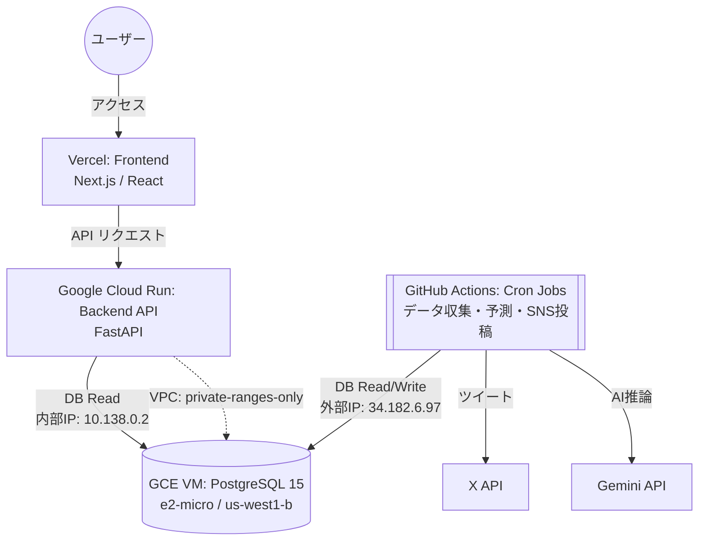

# コスト最適化アーキテクチャ（2026年4月改訂版）

> **2026-08-04更新**: Vercel HobbyのCPU・ISR writes・Edge Requests超過により、フロントエンドはCloud Run + Cloudflareへ移行準備中です。本章のVercel $0前提や「月額$0」表現は過去構成の記録であり、今後は`docs/cloud_run_cloudflare_migration_20260804.md`の容量ゲートと実測請求を正とします。

## 1. 背景と目的

### 1.1 初期構成（Render時代）
当初はバックエンド（API・DB・Cronジョブ）のすべてをRenderの有料プランで運用しており、月額約 $19.58 のランニングコストが発生していました。
また、開発・デプロイを繰り返した結果、Renderの無料ビルド枠（月間500分）に抵触し、CI/CDがブロックされる事象が発生しました。

### 1.2 第1次移行（2026年3月：Neon移行）
Renderから「Cloud Run + Neon (Serverless Postgres) + GitHub Actions」に完全移行し、月額 $0 を実現。

### 1.3 第2次移行（2026年4月：GCE移行）
Neon Free Tierの **Network Transfer 5GB/月** 上限を超過し、Computeが完全停止（サイトダウン）する事象が発生。
根本原因は、ISRリクエストやGitHub Actionsのジョブによるegress転送量の累積がNeon Free Tierの上限を超えたこと。
TTLキャッシュ実装やジョブ頻度削減等の施策では抑制しきれなかったため、**Google Compute Engine (GCE) の e2-micro VM（永久無料枠）に PostgreSQL を自前構築**する方針に切り替え、データを完全移行しました。

> **結論**: 現在は **月額 $0** かつ **転送量制限なし** のアーキテクチャで安定稼働中。

---

## 2. 現行システム構成図



---

## 3. 各コンポーネントの役割と選定理由

### ① フロントエンド（Vercel）
*   **用途**: Next.jsアプリケーションのホスティング。
*   **プラン**: Hobbyプラン（無料）
*   **狙い**: 静的リソースのCDN配信とISR（Incremental Static Regeneration）を活用し、バックエンドへの過剰なアクセスを緩和。

### ② バックエンドAPI（Google Cloud Run）
*   **用途**: FastAPIによるWeb API提供（フロントエンドからのデータ取得窓口）。
*   **旧環境**: Render Web Service（Starterプラン: $7.00/月）
*   **狙い・上限事項**:
    *   **ゼロスケール**: リクエストがないときはコンテナが停止するため、維持費が掛かりません。
    *   **コスト**: 月間200万リクエストまでは無料枠に収まるため、実質無料で運用可能。
    *   **VPC接続**: `default` ネットワークに接続し、`private-ranges-only` のVPC Egressを設定。GCE VMへは **内部IP (10.138.0.2)** 経由で通信するため、外部通信（egress）が発生しません。
    *   **コールドスタート**: VercelのISRキャッシュと組み合わせることでユーザー体験への影響を吸収。

### ③ データベース（GCE VM 自前 PostgreSQL）
*   **用途**: レース情報、予測データなどの永続化層（PostgreSQL 15）。
*   **旧環境**: Neon Serverless Postgres（Free Tier → Launch Plan $3/月）
*   **移行理由**: Neon Free TierのNetwork Transfer 5GB/月上限によるサイトダウン
*   **現構成**:
    *   **VM**: `e2-micro` インスタンス（GCE永久無料枠）
    *   **リージョン**: `us-west1-b`
    *   **内部IP**: `10.138.0.2`（Cloud Runからの接続用）
    *   **外部IP**: `34.182.6.97`（GitHub Actions・ローカル開発からの接続用）
    *   **DBユーザー**: `keiba_user` / DB名: `keiba_db`
    *   **ディスク**: 30GB 標準永続ディスク（無料枠内）
*   **PostgreSQL設定**:
    *   `shared_buffers = 256MB`（e2-micro最適化）
    *   `max_connections = 50`
    *   `pg_hba.conf`: Cloud Run VPCサブネット (`10.0.0.0/8`) と外部IPを許可
*   **メリット**:
    *   **転送量制限なし**: GCE→Cloud Run間はVPC内部通信のため無課金
    *   **ストレージ制限緩和**: 30GB（Neon Free Tierの512MBから大幅増加）
    *   **常時起動**: サーバーレスではないため、コールドスタートなし
*   **注意事項**:
    *   自動バックアップが無いため、定期的な `pg_dump` の導入を推奨
    *   VM再起動時はPostgreSQLが自動起動（systemdで管理）

### ④ バッチ定時処理・Cronジョブ（GitHub Actions）
*   **用途**: JRA等のレースデータ収集、Gemini APIによる予測実行、X（旧Twitter）への定期投稿など。
*   **旧環境**: Render Cron Jobs（8ジョブ合計: 約$6.28/月）
*   **狙い・上限事項**:
    *   **無料化**: GitHub Actions（ubuntu-latest）に完全移行しランニングコストゼロ。
    *   **上限**: パブリックリポジトリであれば実行時間は無制限、プライベートリポジトリでも月間 2,000分の無料枠。
    *   **DB接続**: GCE VMの外部IP (`34.182.6.97:5432`) 経由で接続。GitHub Secrets に `DATABASE_URL` を設定済み。

---

## 4. ネットワーク構成

```
┌─ Google Cloud (us-west1) ─────────────────────────────┐
│                                                        │
│   Cloud Run (keiba-site-v1)                            │
│   ├─ VPC: default                                      │
│   ├─ Subnet: default                                   │
│   └─ Egress: private-ranges-only                       │
│          │                                              │
│          │  内部通信 (10.138.0.2:5432)                  │
│          │  ※ egressコストなし                          │
│          ▼                                              │
│   GCE VM (keiba-db, e2-micro)                          │
│   ├─ 内部IP: 10.138.0.2                               │
│   ├─ 外部IP: 34.182.6.97 (静的)                       │
│   ├─ Firewall: allow-postgres (tcp:5432)               │
│   └─ PostgreSQL 15                                     │
│                                                        │
└────────────────────────────────────────────────────────┘
          ▲
          │  外部接続 (34.182.6.97:5432)
          │
  ┌───────┴────────┐
  │ GitHub Actions  │  ← Cron (データ収集・予測・SNS)
  │ ローカル開発    │  ← .env の DATABASE_URL
  └────────────────┘
```

---

## 5. コスト比較

| 項目 | Render時代 | Neon時代 | **GCE時代（現行）** |
|:---|:---|:---|:---|
| フロントエンド | Vercel $0 | Vercel $0 | **Vercel $0** |
| バックエンドAPI | Render $7 | Cloud Run $0 | **Cloud Run $0** |
| データベース | Render $7 | Neon $0 (Free) | **GCE e2-micro $0** |
| Cronジョブ | Render $6 | GitHub Actions $0 | **GitHub Actions $0** |
| **月額合計** | **$20** | **$0** | **$0** |
| 転送量制限 | なし | **5GB/月（致命的）** | **なし** |
| ストレージ | 1GB | 512MB | **30GB** |

---

## 6. 今後の運用上の注意点

*   **GCE VM監視**: https://console.cloud.google.com/compute/instances で VM が `RUNNING` であることを定期確認。
*   **バックアップ未設定**: GCE VMには自動バックアップがないため、`pg_dump` による定期バックアップcronの導入を推奨。
*   **ファイアウォール**: `allow-postgres` ルール（tcp:5432, 全IP許可）が設定済み。セキュリティ強化が必要な場合はソースIPを制限すること。
*   **e2-micro制約**: vCPU 0.25 / RAM 1GB のため、大量同時接続には対応できない。現在の `pool_size=2, max_overflow=1` の設定で問題なく稼働中。
*   **課金監視**: https://console.cloud.google.com/billing で、無料枠を超過していないか月次で確認。
*   **Neon**: 2026年4月11日付で解約済み。

---

## 7. 移行履歴

| 日付 | 内容 |
|:---|:---|
| 2026-03-xx | Render → Cloud Run + Neon + GitHub Actions に全面移行 |
| 2026-04-10 | Neon Network Transfer 5GB/月上限超過によりサイトダウン |
| 2026-04-11 | Neon Launch Plan ($3/月) に緊急アップグレード → 復旧 |
| 2026-04-11 | GCE e2-micro VM構築 → PostgreSQL 15セットアップ → データ完全移行 |
| 2026-04-11 | Cloud Run VPC接続 → DATABASE_URL切り替え → サイト復旧確認 |
| 2026-04-11 | GitHub Actions cron復元、GitHub Secrets更新 |
| 2026-04-12 | Neon解約完了 |
| 2026-06-13 | 2026年5月のGCPコスト要因（Network Analyzer, Artifact Registry等）を分析し、最適化アクションを追記 |

---

## 8. 2026年5月コスト発生の要因分析と最適化

2026年5月のGCP請求書（合計¥739）に基づき、当初想定していた「月額 $0」から超過した要因と、それを最適化（削減）するための具体的なアクションをまとめました。

### 8.1 要因の内訳と対策

| サービス | 発生費用 | 主な発生要因 | 最適化アクション（削減策） |
| :--- | :--- | :--- | :--- |
| **Networking** | **¥356** | Network Intelligence Center の **Network Analyzer** が有効になっており、監視対象リソースの稼働時間に応じて課金が発生。 | **Network Analyzer の自動監視を無効化** する（シンプルな構成のため常時監視は不要）。 |
| **Cloud Run** | **¥308** | コールドスタート対策としての最小インスタンス数（`min-instances`）の設定、またはCPUの常時割り当てが有効なため待機中も課金が発生。 | 最小インスタンス数を `0` に変更し、CPU割り当てを「リクエスト処理中のみ」とする（ゼロスケール化）。フロント側がISRのため遅延は影響しにくい。 |
| **Artifact Registry**| **¥58** | GitHub Actionsによるビルド・デプロイで古いコンテナイメージが蓄積し、無料枠（5GB）を超過。 | **クリーンアップポリシー** を設定し、古いイメージ（タグなしイメージ等）を自動削除するように設定。 |
| **Compute Engine** | **¥10** | `e2-micro`（us-west1）の無料枠内だが、ディスク種類（Standard以外）やサイズ（30GB超）、一時的な未使用IPアドレス等による微小な課金。 | ディスクが「標準永続ディスク」かつ30GB以下であるか、不要なスナップショットがないかを確認。 |

### 8.2 具体的な対応手順（GCPコンソールでの作業）

1. **Network Analyzer の無効化**:
   - GCPコンソールの「Network Intelligence Center」 ＞ 「Network Analyzer」に移動し、自動分析の実行を停止・無効化する。
2. **Cloud Run のゼロスケール設定**:
   - 「Cloud Run」から該当サービス（`keiba-site-v1`）を選択し、「新しいリビジョンの編集とデプロイ」を開く。
   - 最小インスタンス数を `0` に設定し、CPU割り当てが「リクエスト処理中のみ」であることを確認する。
3. **Artifact Registry のクリーンアップポリシー設定**:
   - 「Artifact Registry」で該当リポジトリを開き、「クリーンアップポリシー」タブから、古いイメージやタグなしイメージを自動でクリーンアップするルール（例：最新の3世代のみ保持）を有効化する。

---

## 9. 2026年8月の実測とコスト再発の分析

2026-08-15に `gcloud` / Cloud Monitoring API / Cloud Logging を読み取り専用で実測した結果。

### 9.1 使用量の実測（2026-07-17〜08-15の30日間）

| 項目 | 30日実測 | 無料枠 | 直近7日からの月換算 | 判定 |
|:---|---:|---:|---:|:---|
| Cloud Run vCPU秒 | 170,076 | 180,000 | 345,870 | 超過 |
| Cloud Run GiB秒 | 125,959 | 360,000 | 269,685 | 枠内 |
| Cloud Run リクエスト | 908,442 | 2,000,000 | 1,433,790 | 枠内(72%) |
| Cloud Run 送信（対外） | 10.7 GB | 1 GB | 17.3 GB | 課金 |
| GCE→Cloud Run 転送 | 445.7 GB | — | 1,165 GB | 要確認 |
| Artifact Registry | 2.45 GB | 0.5 GB | — | 超過 |
| Cloud Logging | 1.45 GB | 50 GiB | — | 枠内 |

GCS（6MB）、Cloud Build（月20回程度）、GCE e2-micro + 30GB pd-standard はいずれも無料枠内。
GCE VMの外部IPは削除済みで、アイドルIP課金は発生していない。

### 9.2 08-04を境にした急増

```
07-17〜07-30   0.34〜0.43 GB/日   （Vercel時代・安定）
07-31〜08-03   1.29〜1.69 GB/日
08-04以降     15.3〜115.7 GB/日  （Cloud Runフロントエンド稼働開始）
```

ピーク日（08-09）を時間別に分解すると、DB送信量はバックエンドのリクエスト数と線形に相関し、
バッチ処理起因ではないことを確認した。**1リクエストあたり2〜3.5MBをDBから読み、返すJSONは約1KB**。

### 9.3 特定した原因

| # | 原因 | 箇所 | 対応 |
|:--|:---|:---|:---|
| 1 | `_apply_publication_state()` が `entity_id` で絞らず、公開状態テーブルを毎回全件読み込み | `backend/crud/growth_crud.py` | 2026-08-15 修正済み |
| 2 | `_dataset_range()`（全レースのmin/max）を1リクエストで複数回実行 | `backend/crud/growth_crud.py` | 2026-08-15 TTLキャッシュ化 |
| 3 | アーカイブガードの遮断対象が検索エンジンのみで、Googlebot・bingbotだけが503を受け取っていた | `frontend/middleware.ts` | 2026-08-15 修正済み |
| 4 | `/articles` が `no-store` を返しCDNが常にBYPASS | `frontend/next.config.mjs` | 2026-08-15 修正済み |
| 5 | `app/robots.ts` が `public/robots.txt` に隠蔽され無効化。`sitemap-data.xml` の宣言も欠落 | `frontend/` | 2026-08-15 `public/robots.txt` へ統合 |
| 6 | フロント→バックエンドが公開run.app URL経由でインターネット往復 | `frontend/lib/api-base.ts` | 受け口のみ実装（下記の制約あり） |
| 7 | Artifact Registry のクリーンアップが緩い（keepCount 10 / 14日） | Artifact Registry | 未対応 |
| 8 | `keiba-frontend-v1` の maxScale が 20（移行文書の想定は2） | Cloud Run | 未対応 |

### 9.4 オリジン到達の内訳（直近3時間・3,000件）

- ルート別: `/races` 52%（うち15日以上前が64%）、`/horses` 9%、検索 7%
- UA別: 人間/不明 59%、Meta 26%、bingbot 7%、その他ボット 6%、Googlebot 1%

Cloudflareのキャッシュ自体は機能している（アーカイブレース・トップページともHIT）。
ただしレース詳細・競走馬詳細は件数が非常に多く、クローラーが1件ずつ辿ると
初回アクセスは必ずMISSになる。したがって「キャッシュを強くする」ではなく
「1回のオリジン処理を安くする」「大量巡回そのものを減らす」の両方が必要。

### 9.5 バックエンドAPIの呼び出し元（実測）

| 呼び出し元 | 割合 | 主な対象 |
|:---|---:|:---|
| SSR（Cloud Runフロントエンド、UA=`node`） | 81% | レース詳細・データ詳細 |
| ブラウザ直接 | 18% | `/api/v1/predictions/matchups/` |

**ブラウザがバックエンドを直接叩いているため、`keiba-site-v1` を内部ingress専用にはできない。**
対戦成績機能が動かなくなる。SSRだけを内部経路へ寄せる場合も、
Cloud Run間の内部通信には VPC egress の `all-traffic` 化と Private Google Access の
DNS設定が必要で、削減見込みは月4.2GB（約¥75）にとどまる。費用対効果は低い。

### 9.6 修正デプロイ後の実測（2026-08-16 09:56 JST デプロイ）

同一トラフィック水準での比較（Cloud Run リビジョン `00363` → `00364`）。

| 指標 | 修正前 | 修正後 | 変化 |
|:---|---:|---:|---:|
| DB送信量 / バックエンド1リクエスト | 0.60〜0.94 MB | 0.011 MB | 約1/60 |
| 5分あたりDB送信量（req数ほぼ同等） | 49〜58 MB | 1.0 MB | 約1/50 |
| `/api/v1/data/horses/{id}` 平均応答 | 6,040 ms | 168 ms | 約1/36 |
| 同 最大応答 | 32,860 ms | 330 ms | 約1/100 |
| データ詳細API p95（ログ集計） | 10.93 秒 | 0.76 秒未満 | — |

月換算では DB送信 約1,165 GB → 約7 GB の見込み（目標50GB以下を達成）。

クローラー制御の動作確認：

| UA | アーカイブレース | 未公開データ詳細 |
|:---|:---|:---|
| Googlebot | 200 | 200 |
| bingbot | 200 | — |
| facebookexternalhit | 200 | — |
| 通常ブラウザ | 200 | — |
| meta-webindexer | 503 | 503 |
| GPTBot | 503 | — |

`/articles` は BYPASS から HIT へ改善。`robots.txt` に `sitemap-data.xml` 宣言を追加済み。

### 9.7 未確定事項

`GCE→Cloud Run` 間の転送（月1,165GB）が実際に課金対象かどうかが最大の不確実要素で、
月¥1,750規模の差になる。BigQuery請求エクスポートを設定してSKU別に確定させること。
